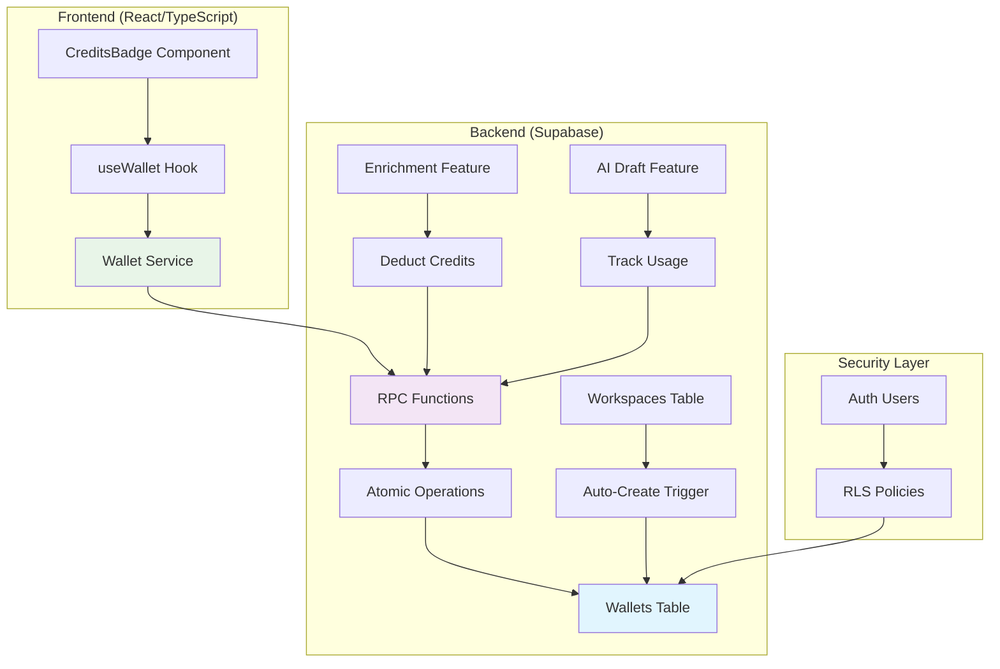
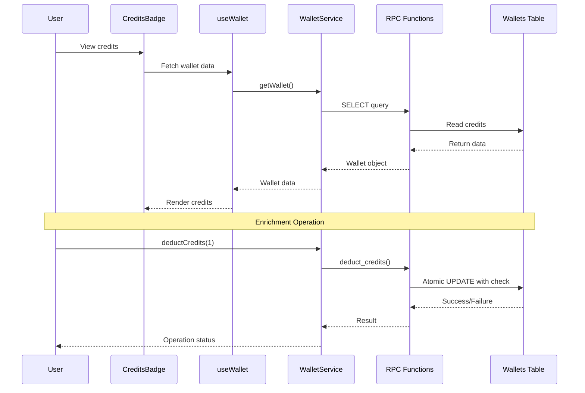

# Wallet & Credit System Implementation Plan

## Overview
Implement a credit-based usage tracking system for the Scout AI SDR Agent. The system will track data credits for enrichment operations and AI draft usage for analytics.

## System Architecture



## Workflow Diagram



## Database Schema Design

### 1. Wallets Table
```sql
CREATE TABLE public.wallets (
  id UUID PRIMARY KEY DEFAULT gen_random_uuid(),
  workspace_id UUID NOT NULL REFERENCES public.workspaces(id) ON DELETE CASCADE,
  data_credits INTEGER NOT NULL DEFAULT 50,
  ai_drafts_usage INTEGER NOT NULL DEFAULT 0,
  plan_type TEXT NOT NULL DEFAULT 'FREE',
  created_at TIMESTAMPTZ DEFAULT NOW(),
  updated_at TIMESTAMPTZ DEFAULT NOW(),
  
  -- Ensure 1-to-1 relationship with workspaces
  UNIQUE(workspace_id)
);

-- Enable Row Level Security
ALTER TABLE public.wallets ENABLE ROW LEVEL SECURITY;

-- RLS Policies
CREATE POLICY "Users can view wallets of workspaces they are members of"
ON public.wallets
FOR SELECT
USING (
  EXISTS (
    SELECT 1 FROM public.workspace_members
    WHERE workspace_id = wallets.workspace_id
    AND user_id = auth.uid()
  )
  OR EXISTS (
    SELECT 1 FROM public.workspaces
    WHERE id = wallets.workspace_id
    AND owner_id = auth.uid()
  )
);

CREATE POLICY "System can update wallets"
ON public.wallets
FOR UPDATE
USING (true)  -- Will be restricted by RPC functions
WITH CHECK (true);
```

### 2. RPC Functions for Atomic Operations

#### 2.1 Deduct Credits (Atomic)
```sql
CREATE OR REPLACE FUNCTION public.deduct_credits(
  _workspace_id UUID,
  _amount INTEGER
)
RETURNS BOOLEAN
LANGUAGE plpgsql
SECURITY DEFINER
AS $$
DECLARE
  _current_credits INTEGER;
  _success BOOLEAN := FALSE;
BEGIN
  -- Lock the row for update
  UPDATE public.wallets
  SET data_credits = data_credits - _amount,
      updated_at = NOW()
  WHERE workspace_id = _workspace_id
    AND data_credits >= _amount
  RETURNING data_credits INTO _current_credits;
  
  -- Return true if update succeeded
  IF FOUND THEN
    _success := TRUE;
  END IF;
  
  RETURN _success;
END;
$$;
```

#### 2.2 Add Credits
```sql
CREATE OR REPLACE FUNCTION public.add_credits(
  _workspace_id UUID,
  _amount INTEGER
)
RETURNS BOOLEAN
LANGUAGE plpgsql
SECURITY DEFINER
AS $$
BEGIN
  UPDATE public.wallets
  SET data_credits = data_credits + _amount,
      updated_at = NOW()
  WHERE workspace_id = _workspace_id;
  
  RETURN FOUND;
END;
$$;
```

#### 2.3 Track AI Usage
```sql
CREATE OR REPLACE FUNCTION public.track_ai_usage(
  _workspace_id UUID
)
RETURNS BOOLEAN
LANGUAGE plpgsql
SECURITY DEFINER
AS $$
BEGIN
  UPDATE public.wallets
  SET ai_drafts_usage = ai_drafts_usage + 1,
      updated_at = NOW()
  WHERE workspace_id = _workspace_id;
  
  RETURN FOUND;
END;
$$;
```

#### 2.4 Check Sufficient Credits
```sql
CREATE OR REPLACE FUNCTION public.has_sufficient_credits(
  _workspace_id UUID,
  _required_amount INTEGER
)
RETURNS BOOLEAN
LANGUAGE sql
STABLE
SECURITY DEFINER
AS $$
  SELECT EXISTS (
    SELECT 1 FROM public.wallets
    WHERE workspace_id = _workspace_id
      AND data_credits >= _required_amount
  );
$$;
```

### 3. Database Trigger for Auto-Wallet Creation
```sql
-- Function to create wallet for new workspace
CREATE OR REPLACE FUNCTION public.create_wallet_for_new_workspace()
RETURNS TRIGGER
LANGUAGE plpgsql
SECURITY DEFINER
AS $$
BEGIN
  INSERT INTO public.wallets (workspace_id, plan_type)
  VALUES (NEW.id, 'FREE');
  RETURN NEW;
END;
$$;

-- Trigger on workspaces table
CREATE TRIGGER create_wallet_after_workspace_insert
  AFTER INSERT ON public.workspaces
  FOR EACH ROW
  EXECUTE FUNCTION public.create_wallet_for_new_workspace();
```

## Backend Service Implementation

### File: `src/lib/wallet-service.ts`
```typescript
import { supabase } from '@/integrations/supabase/client';
import { Database } from '@/integrations/supabase/types';

export type Wallet = Database['public']['Tables']['wallets']['Row'];

export interface WalletService {
  getWallet(workspaceId: string): Promise<Wallet | null>;
  hasSufficientCredits(workspaceId: string, amount: number): Promise<boolean>;
  deductCredits(workspaceId: string, amount: number): Promise<boolean>;
  addCredits(workspaceId: string, amount: number): Promise<boolean>;
  trackAIUsage(workspaceId: string): Promise<boolean>;
}

class WalletServiceImpl implements WalletService {
  async getWallet(workspaceId: string): Promise<Wallet | null> {
    const { data, error } = await supabase
      .from('wallets')
      .select('*')
      .eq('workspace_id', workspaceId)
      .single();
    
    if (error) {
      console.error('Error fetching wallet:', error);
      return null;
    }
    
    return data;
  }

  async hasSufficientCredits(workspaceId: string, amount: number): Promise<boolean> {
    const { data, error } = await supabase
      .rpc('has_sufficient_credits', {
        _workspace_id: workspaceId,
        _required_amount: amount
      });
    
    if (error) {
      console.error('Error checking credits:', error);
      return false;
    }
    
    return data;
  }

  async deductCredits(workspaceId: string, amount: number): Promise<boolean> {
    const { data, error } = await supabase
      .rpc('deduct_credits', {
        _workspace_id: workspaceId,
        _amount: amount
      });
    
    if (error) {
      console.error('Error deducting credits:', error);
      return false;
    }
    
    return data;
  }

  async addCredits(workspaceId: string, amount: number): Promise<boolean> {
    const { data, error } = await supabase
      .rpc('add_credits', {
        _workspace_id: workspaceId,
        _amount: amount
      });
    
    if (error) {
      console.error('Error adding credits:', error);
      return false;
    }
    
    return data;
  }

  async trackAIUsage(workspaceId: string): Promise<boolean> {
    const { data, error } = await supabase
      .rpc('track_ai_usage', {
        _workspace_id: workspaceId
      });
    
    if (error) {
      console.error('Error tracking AI usage:', error);
      return false;
    }
    
    return data;
  }
}

export const walletService: WalletService = new WalletServiceImpl();
```

## Frontend Component

### File: `src/components/layout/CreditsBadge.tsx`
```tsx
import React from 'react';
import { Badge } from '@/components/ui/badge';
import { Tooltip, TooltipContent, TooltipProvider, TooltipTrigger } from '@/components/ui/tooltip';
import { Zap } from 'lucide-react';
import { useWallet } from '@/hooks/useWallet';

interface CreditsBadgeProps {
  workspaceId?: string;
  className?: string;
}

export function CreditsBadge({ workspaceId, className }: CreditsBadgeProps) {
  const { wallet, isLoading } = useWallet(workspaceId);
  
  if (isLoading || !wallet) {
    return (
      <Badge variant="outline" className={className}>
        <Zap className="h-3 w-3 mr-1" />
        Loading...
      </Badge>
    );
  }
  
  return (
    <TooltipProvider>
      <Tooltip>
        <TooltipTrigger asChild>
          <Badge variant="outline" className={className}>
            <Zap className="h-3 w-3 mr-1" />
            {wallet.data_credits} Credits
          </Badge>
        </TooltipTrigger>
        <TooltipContent>
          <div className="space-y-1">
            <p className="font-medium">Credit Balance</p>
            <p className="text-sm">Plan: {wallet.plan_type}</p>
            <p className="text-sm">AI Drafts Used: {wallet.ai_drafts_usage} (Unlimited)</p>
            <p className="text-xs text-muted-foreground">
              Credits are used for enrichment operations
            </p>
          </div>
        </TooltipContent>
      </Tooltip>
    </TooltipProvider>
  );
}
```

### File: `src/hooks/useWallet.tsx`
```tsx
import { useQuery } from '@tanstack/react-query';
import { walletService } from '@/lib/wallet-service';
import { useWorkspace } from './useWorkspace';

export function useWallet(workspaceId?: string) {
  const { workspace } = useWorkspace();
  const targetWorkspaceId = workspaceId || workspace?.id;
  
  const { data: wallet, isLoading, error, refetch } = useQuery({
    queryKey: ['wallet', targetWorkspaceId],
    queryFn: () => {
      if (!targetWorkspaceId) throw new Error('No workspace ID');
      return walletService.getWallet(targetWorkspaceId);
    },
    enabled: !!targetWorkspaceId,
    refetchInterval: 30000, // Refresh every 30 seconds
  });
  
  return {
    wallet,
    isLoading,
    error,
    refetch,
    hasSufficientCredits: async (amount: number) => {
      if (!targetWorkspaceId) return false;
      return walletService.hasSufficientCredits(targetWorkspaceId, amount);
    },
    deductCredits: async (amount: number) => {
      if (!targetWorkspaceId) return false;
      return walletService.deductCredits(targetWorkspaceId, amount);
    },
    trackAIUsage: async () => {
      if (!targetWorkspaceId) return false;
      return walletService.trackAIUsage(targetWorkspaceId);
    },
  };
}
```

## Integration Points

### 1. Sidebar Integration
Add to `src/components/layout/Sidebar.tsx`:
```tsx
// Add import
import { CreditsBadge } from '@/components/layout/CreditsBadge';

// Add in the user section (around line 117-130)
<div className="p-3 border-t border-border">
  <div className="flex items-center gap-2.5">
    <div className="h-8 w-8 rounded-full bg-muted flex items-center justify-center">
      <span className="text-xs font-medium">{initials}</span>
    </div>
    {!collapsed && (
      <div className="flex-1 min-w-0">
        <p className="text-sm font-medium truncate">{fullName}</p>
        <p className="text-xs text-muted-foreground truncate">Sales CRM</p>
        {/* Add CreditsBadge here */}
        <div className="mt-1">
          <CreditsBadge />
        </div>
      </div>
    )}
  </div>
</div>
```

### 2. Header Integration (Alternative)
Add to `src/components/layout/Header.tsx`:
```tsx
// Add import
import { CreditsBadge } from '@/components/layout/CreditsBadge';

// Add in the actions section (around line 31-48)
<div className="flex items-center gap-2">
  {/* Credits Badge */}
  <CreditsBadge />
  
  {/* Custom actions */}
  {actions}
  
  {/* Theme Toggle */}
  <ThemeToggle />
  
  {/* AI-Powered Notification Center */}
  <NotificationCenter />
  
  {/* Action button */}
  {action && (
    <Button onClick={action.onClick} size="sm" className="gap-1.5">
      <Plus className="h-4 w-4" />
      <span className="hidden sm:inline">{action.label}</span>
    </Button>
  )}
</div>
```

## Usage in Features

### 1. Enrichment Operations
```typescript
import { walletService } from '@/lib/wallet-service';

async function performEnrichment(workspaceId: string, contactId: string) {
  const hasCredits = await walletService.hasSufficientCredits(workspaceId, 1);
  
  if (!hasCredits) {
    throw new Error('Insufficient credits for enrichment');
  }
  
  // Perform enrichment logic...
  
  // Deduct credit after successful enrichment
  const success = await walletService.deductCredits(workspaceId, 1);
  if (!success) {
    console.error('Failed to deduct credits');
  }
}
```

### 2. AI Draft Generation
```typescript
import { walletService } from '@/lib/wallet-service';

async function generateAIDraft(workspaceId: string, prompt: string) {
  // Generate AI draft...
  
  // Track usage (unlimited, just for analytics)
  await walletService.trackAIUsage(workspaceId);
}
```

## Migration Strategy

### Step 1: Create Migration File
Create `supabase/migrations/20260118_create_wallets_table.sql` with all SQL definitions.

### Step 2: Backfill Existing Workspaces
```sql
-- Create wallets for existing workspaces
INSERT INTO public.wallets (workspace_id, plan_type)
SELECT id, 'FREE' FROM public.workspaces
WHERE id NOT IN (SELECT workspace_id FROM public.wallets);
```

### Step 3: Update TypeScript Types
Run Supabase CLI to regenerate types:
```bash
npx supabase gen types typescript --project-id your-project-id > src/integrations/supabase/types.ts
```

## Testing Plan

1. **Database Level Tests**
   - Verify wallet creation trigger works
   - Test RPC functions for atomic operations
   - Verify RLS policies restrict access appropriately

2. **Service Level Tests**
   - Test wallet service methods
   - Verify error handling
   - Test concurrent credit deductions

3. **UI Level Tests**
   - Verify CreditsBadge displays correctly
   - Test tooltip information
   - Verify real-time updates

## Security Considerations

1. **RLS Policies**: Ensure users can only view wallets of workspaces they belong to
2. **Atomic Operations**: Use RPC functions to prevent race conditions
3. **Audit Logging**: Consider adding audit trail for credit transactions
4. **Rate Limiting**: Implement rate limiting on credit deduction operations

## Future Enhancements

1. **Credit Purchase Flow**: Integrate with Stripe for credit purchases
2. **Usage Analytics Dashboard**: Show credit usage trends
3. **Credit Alerts**: Notify users when credits are low
4. **Team Credit Allocation**: Allow workspace owners to allocate credits to team members
5. **Credit Expiration**: Implement credit expiration for trial credits